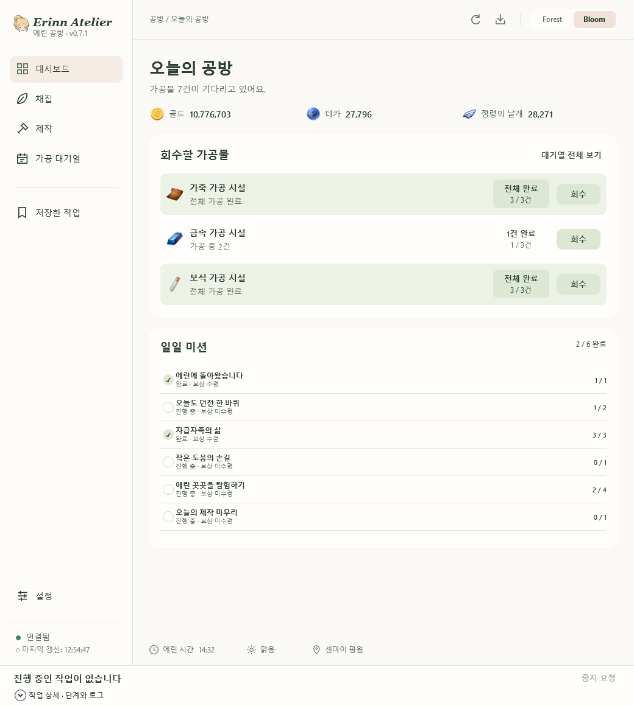
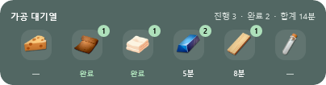
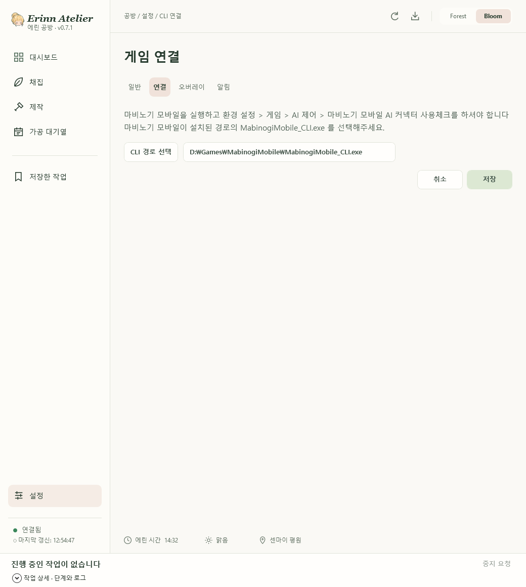

# 에린 공방 — 마비노기 모바일 Windows 도우미

**에린 공방(Erinn Atelier)**은 마비노기 모바일의 채집·제작 작업과 가공 대기열을 한곳에서 관리하는 Windows 앱입니다. 게임에서 제공하는 `MabinogiMobile_CLI.exe`로 연결하며, 외부 AI 모델이나 별도의 AI API 키 없이 사용할 수 있습니다.

**[최신 버전 다운로드](https://github.com/mingsday/ErinnAtelier-Releases/releases/latest)** · [전체 릴리스 및 변경내역](https://github.com/mingsday/ErinnAtelier-Releases/releases)

## 주요 기능

- **공방 현황 확인**: 재화, 일일 미션, 회수할 가공물을 한 화면에서 확인합니다.
- **채집·제작 관리**: 대상을 선택해 작업하거나 자주 사용하는 작업을 저장해 실행합니다.
- **가공 대기열과 완료 알림**: 가공 상태를 확인하고 Windows 알림·소리로 완료 안내를 받습니다.
- **게임 오버레이**: 작업 진행, 가공 대기열, 주변 인물, 현실·에린 시간과 날씨·위치를 게임 화면 위에 표시합니다.
- **화면 꾸미기**: 밝은 Bloom·어두운 Forest 테마와 오버레이 배경색·강조색·불투명도 설정을 제공합니다.

## 화면 미리보기

### 대시보드

### 오버레이

**시간·환경 정보**

왼쪽 지구 아이콘은 **현실 시간**, 마비노기 모바일 아이콘은 **에린 시간**입니다.

**가공 대기열**

시설별 가공 건수와 완료 여부, 남은 시간을 게임 화면 위에서 확인할 수 있습니다.

*스크린샷은 v0.7.1 미리보기이며, 표시된 게임 정보는 예시입니다.*

## 설치 및 실행

1. [최신 릴리스](https://github.com/mingsday/ErinnAtelier-Releases/releases/latest)의 **Assets**에서 `ErinnAtelier-v버전-win.zip`을 다운로드합니다. `Source code` 파일은 실행용 배포본이 아닙니다.
2. ZIP 파일을 원하는 폴더에 **모두 압축 해제**합니다.
3. 압축을 푼 폴더에서 **`ErinnAtelier.exe`**를 실행합니다. `assets`, `data` 폴더와 다른 동봉 파일도 함께 보관해주세요.
4. 아래 안내에 따라 게임의 AI 커넥터와 CLI 경로를 설정합니다.

앱과 마비노기 모바일은 **같은 Windows 로그인 계정**에서 실행해주세요.

## 게임·CLI 연결 방법

1. **마비노기 모바일 PC 클라이언트**를 실행하고 캐릭터에 접속합니다.
2. 게임의 **환경 설정 → 게임 → AI 제어**에서 **마비노기 모바일 AI 커넥터 사용**을 켭니다.
3. 에린 공방에서 **설정 → 연결**로 이동합니다.
4. **CLI 경로 선택**을 눌러 게임 설치 폴더의 **`MabinogiMobile_CLI.exe`**를 선택합니다.
5. **저장**을 누른 뒤 좌하단에 **연결됨**이 표시되는지 확인합니다. 필요하면 상단 새로고침 버튼을 눌러주세요.

예시 경로: `D:\Games\MabinogiMobile\MabinogiMobile_CLI.exe`

설치 위치는 PC마다 다릅니다. 예시 경로를 그대로 입력하기보다 실제 게임 설치 폴더에서 파일을 선택해주세요. CLI는 게임에서 제공하는 파일이며, 에린 공방 ZIP에 포함되지 않습니다.

## 연결이 안 될 때

- 게임이 실행 중이고 캐릭터에 접속해 있는지 확인해주세요.
- 게임 설정에서 **AI 커넥터 사용**이 켜져 있는지 확인해주세요.
- 선택한 파일이 `MabinogiMobile_CLI.exe`인지 확인하고 **저장**을 눌러주세요.
- 좌하단의 **연결 설정 열기**를 누르면 CLI 경로를 다시 설정할 수 있습니다.

## 오버레이 사용

**설정 → 오버레이**에서 필요한 표시를 켭니다. 작은 오버레이 컨트롤러의 자물쇠로 이동을 잠그거나 해제하고, 눈 아이콘으로 전체 표시를 숨기거나 복원할 수 있습니다.

게임은 **창 모드 또는 테두리 없는 창 모드**를 권장합니다. 독점 전체화면에서는 오버레이가 보이지 않을 수 있습니다.

## 업데이트

앱 상단의 업데이트 버튼으로 새 버전을 확인하거나, [최신 릴리스 페이지](https://github.com/mingsday/ErinnAtelier-Releases/releases/latest)에서 다운로드할 수 있습니다.

이 저장소는 에린 공방의 실행 파일과 변경내역을 제공하는 배포 저장소입니다.
